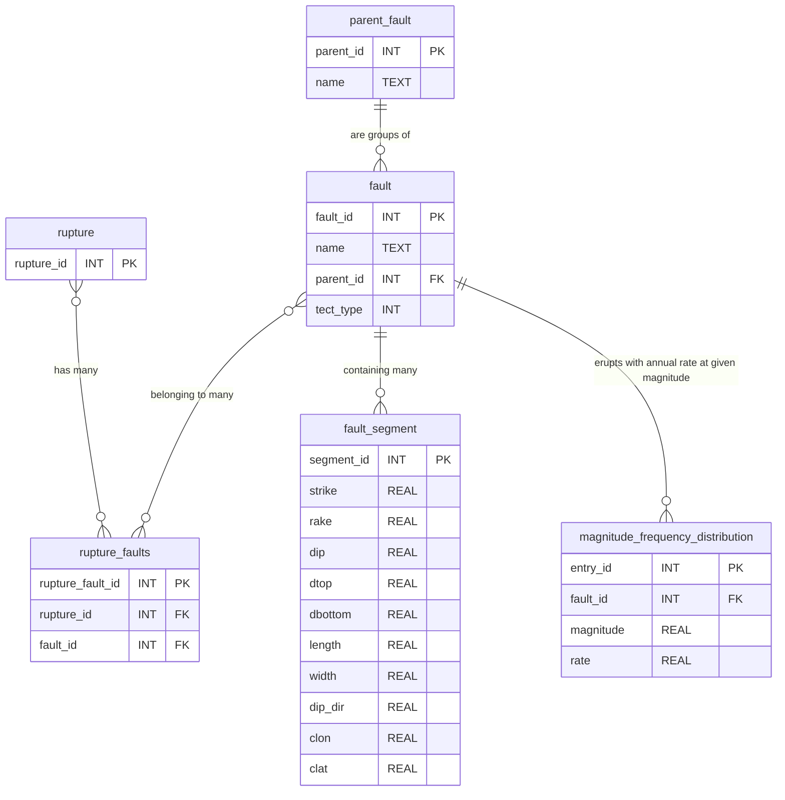

# NSHM Database Generation

This repository contains a script and schema to generate a database storing fault geometry and rupture information parsing GeoJSON information from the GNS National Seismic Hazard Model.

## Requirments 

- Python 3.x
- numpy
- qcore
- sqlite3

## Setting up development environment

Use [Poetry](https://python-poetry.org/) to setup and manage the virtual enviroment. From within the repo run 

```bash
$ poetry lock && poetry install
```

This will install all the dependencies required for development. To start a virtual environment run

```bash
$ poetry shell
```

To integrate with PyCharm (if you use it) see [PyCharm's Documentation](https://www.jetbrains.com/help/pycharm/poetry.html#poetry-pyproject)


## Generate your own database
1. Obtain the CRU fault system solution (ask a member of the software team for this file). It should be a zip file with the following structure
```
.
├── aggregate_rates.csv
├── composite_rates.csv
├── modules.json
├── README
├── ruptures
│   ├── average_slips.csv
│   ├── build_info.json
│   ├── fast_indices.csv
│   ├── fault_sections.geojson
│   ├── grid_node_association_fracts.csv
│   ├── grid_node_sect_associations.csv
│   ├── grid_region.geojson
│   ├── indices.csv
│   ├── inversion_target_mfds.json
│   ├── logic_tree_branch.json
│   ├── mod_sect_min_mags.csv
│   ├── modules.json
│   ├── NZSHM22_TvzSections.csv
│   ├── paleo_constraint_data.json
│   ├── properties.csv
│   ├── regional_inversion_target_mfds.json
│   ├── sect_polygons.geojson
│   ├── sect_slip_rates.csv
│   └── sub_seismo_on_fault_mfds.csv
├── solution
│   ├── annealing_progress.csv
│   ├── build_info.json
│   ├── inversion_misfit_progress.csv
│   ├── modules.json
│   ├── rates.csv
│   └── sub_seismo_on_fault_mfds.csv
└── WARNING.md
```
2. Copy the `fault_sections.geojson` and `fast_indices.csv` file into the directory contaning the script.
3. For some reason (pandas shenanigans?) the `fast_indices.csv` which maps between rupture ids and fault segment ids uses ints for the ruptures and *floats* for the fault segment ids. Run the following in the command line to turn the floats into integers.
```bash
$ sed -i 's/\.0//' fast_indices.csv
```
4. Creating an empty `nshm2022.db` database file.
```bash
$ sqlite3 nshm2022.db < schema.db
```
5. Populate the database using the `nshm_geojson_fault_parser.py` script.
```bash
$ python nshm_geojson_fault_parser.py
```
This step will take some time.

# Database Schema

