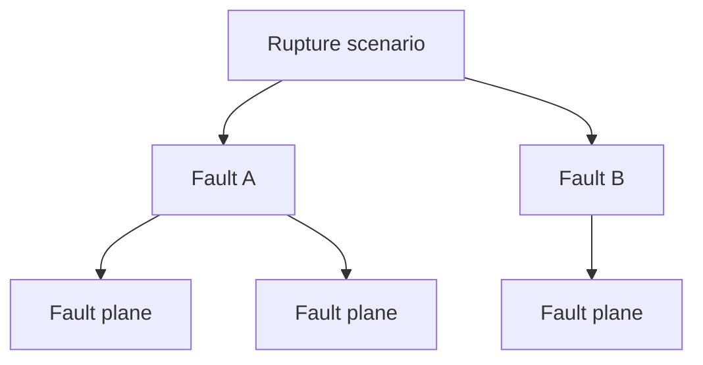
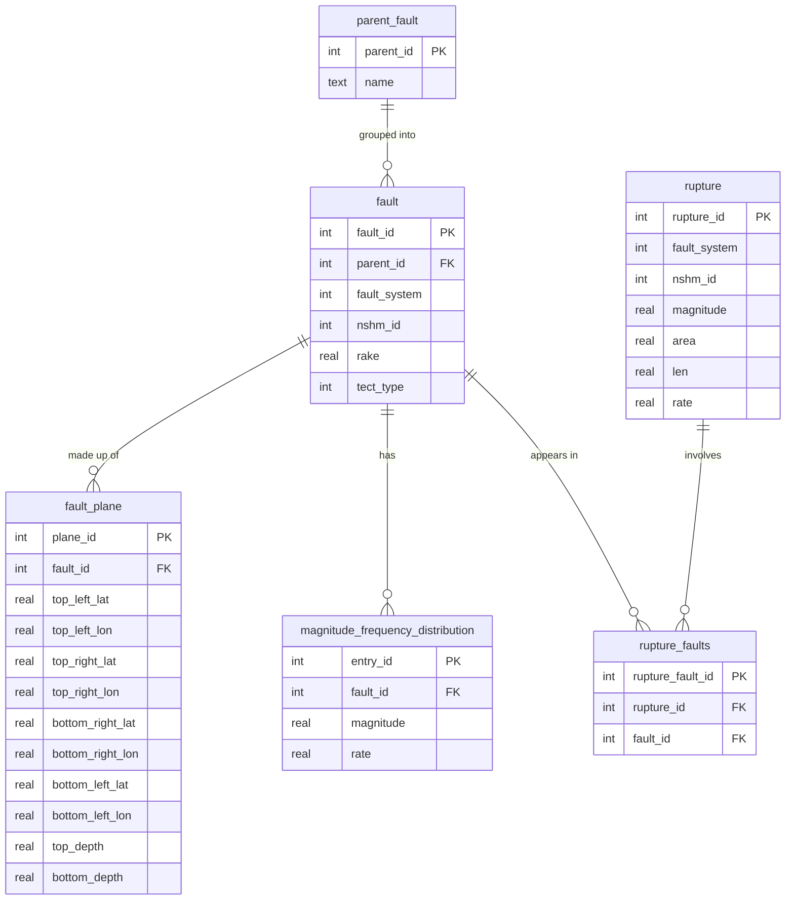

# NSHM Database Generation

This repository contains a script, schema, and Python package for building and
querying a SQLite database of fault geometry and rupture scenario data from
the GNS National Seismic Hazard Model (NSHM) 2022.

## Domain model

The database describes **rupture scenarios**: possible earthquakes formed by
one or more faults rupturing together. The core hierarchy is


```mermaid
graph TD
    R["Rupture scenario"] --> F1["Fault A"]
    R --> F2["Fault B"]
    F1 --> P1["Fault plane"]
    F1 --> P2["Fault plane"]
    F2 --> P3["Fault plane"]
```

- **Rupture scenario** — a single possible earthquake from the NSHM logic tree. It has a magnitude, area,length, and (usually) an annual rate of occurrence, and involves one or more faults.
- **Fault** — a fault (crustal) or a subdivision of a larger fault surface
  (subduction interface), belonging to a fault system (`Crustal`,
  `Hikurangi`, or `Puysegur`). 
  
  Faults are grouped under a **parent fault**: for crustal fault systems, a parent fault is a named fault such as *"Wellington: Wairarapa"* that is made up of several along-strike segments (each a `fault` row); for the subduction interfaces (Hikurangi, Puysegur), every `fault` row is a section of the (single) subduction surface and currently maps one-to-one with its own `parent_fault` entry, distinguished by NSHM id rather than by name.
- **Fault plane** — one planar rectangular patch of a fault's surface, defined by the lat/lon of its four corners plus a top and bottom depth. A fault is represented by one or more of these planes (e.g. a bent or multi-segment fault trace), and a rupture's overall geometry is the union of the planes of every fault it involves.

A rupture typically involves many faults, and each fault can participate in many ruptures (a many-to-many relationship), so a fault's geometry is stored once and shared across every rupture scenario that includes it.

## Database schema

The hierarchy above is implemented with the following tables (see
[`nshmdb/schema/schema.sql`](nshmdb/schema/schema.sql)):

| Table | Represents | Key columns |
|---|---|---|
| `rupture` | A rupture scenario | `rupture_id` (PK), `fault_system`, `nshm_id`, `magnitude`, `area`, `len`, `rate` |
| `rupture_faults` | Join table linking ruptures to the faults they involve | `rupture_id` (FK → `rupture`), `fault_id` (FK → `fault`) |
| `fault` | A fault / fault section belonging to a parent fault | `fault_id` (PK), `parent_id` (FK → `parent_fault`), `fault_system`, `nshm_id`, `rake`, `tect_type` |
| `fault_plane` | One rectangular patch of a fault's geometry | `plane_id` (PK), `fault_id` (FK → `fault`), corner lat/lons, `top_depth`, `bottom_depth` |
| `parent_fault` | A named fault | `parent_id` (PK), `name` |
| `magnitude_frequency_distribution` | Per-fault magnitude/rate pairs (MFD), used to estimate a fault's activity rate at a given magnitude | `fault_id` (FK → `fault`), `magnitude`, `rate` |

Relationships:


```mermaid
erDiagram
    parent_fault ||--o{ fault : "grouped into"
    fault ||--o{ fault_plane : "made up of"
    fault ||--o{ magnitude_frequency_distribution : "has"
    fault ||--o{ rupture_faults : "appears in"
    rupture ||--o{ rupture_faults : "involves"

    parent_fault {
        int parent_id PK
        text name
    }
    fault {
        int fault_id PK
        int parent_id FK
        int fault_system
        int nshm_id
        real rake
        int tect_type
    }
    fault_plane {
        int plane_id PK
        int fault_id FK
        real top_left_lat
        real top_left_lon
        real top_right_lat
        real top_right_lon
        real bottom_right_lat
        real bottom_right_lon
        real bottom_left_lat
        real bottom_left_lon
        real top_depth
        real bottom_depth
    }
    rupture {
        int rupture_id PK
        int fault_system
        int nshm_id
        real magnitude
        real area
        real len
        real rate
    }
    rupture_faults {
        int rupture_fault_id PK
        int rupture_id FK
        int fault_id FK
    }
    magnitude_frequency_distribution {
        int entry_id PK
        int fault_id FK
        real magnitude
        real rate
    }
```

- `parent_fault → fault` is one-to-many: a named fault is made of one or more
  fault sections.
- `fault → fault_plane` is one-to-many: a fault section's surface is
  triangulated/paneled into one or more rectangular planes.
- `fault ↔ rupture` is many-to-many, resolved through `rupture_faults`: a
  rupture involves multiple faults, and a fault can be part of multiple
  ruptures.
- `fault → magnitude_frequency_distribution` is one-to-many: each fault has
  its own MFD used (via `NSHMDB.most_likely_fault`) to estimate which of its
  constituent faults a rupture most likely nucleated on.

`fault_system`, `nshm_id`, and (for ruptures/faults) their pairing under
`UNIQUE(fault_system, nshm_id)` tie every row back to the original NSHM
identifiers, so the database can be cross-referenced against the source NSHM
solution.

## Obtain the database
You likely don't need to obtain your own database, as they are published on Dropbox at `/QuakeCoRE/Public/NSHM` with every version release. Simply download that file and use it with the package:

``` python
from nshmdb.nshmdb import NSHMDB

db = NSHMDB('nshmdb_v2026.06.1.db') # or whatever the latest version is.
```

## Generate your own database
After installing this package you simply run
```bash
nshmdb 1.0.4 nshmdb.db --api-key API_KEY_HERE
```
